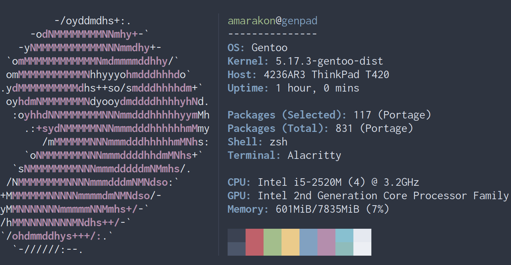

Cfetch
================

## Contents

-   [Advantages of Cfetch Over Other Fetch
    Programs](#advantages-of-cfetch-over-other-fetch-programs)

Cfetch is a suckless-like command-line system information tool. It
displays information about your operating system, kernel, packages, and
more along with ASCII art of your operating system in an elegant way.
The purpose of Cfetch is to quickly get information about everything
quickly instead of using one different program for getting each piece of
information.

[Neofetch](https://github.com/dylanaraps/neofetch) does a poor job at
this because it is extremely slow because it is written in bash, so the
purpose of Neofetch is just for screenshots. Despite this, Cfetch still
looks more pleasing than Neofetch does. Cfetch is a rewrite of Neofetch
in C forked from
[JaGoLi/paleofetch](https://github.com/JaGoLi/paleofetch) which was
forked from [ss7m/paleofetch](https://github.com/ss7m/paleofetch).

Cfetch is still in very early development. Unfortunately, it still only
supports Gentoo. Even worse, it also only works on Linux and Xorg. With
time though, these issues can get resolved.

## Advantages of Cfetch Over Other Fetch Programs

One major reason is the performance improvement. For example: Neofetch
finishes running after about 222 milliseconds where as Cfetch can finish
running in a blazing fast 13 milliseconds. It could be faster, but there
is some shell code in this project that I plan to replace with C code.

Cfetch also has these features:

-   More accurate ASCII art for distribution logos
-   Evenly separated output
-   Vertical line to separate the ASCII art from the information text
-   Cached information

------------------------------------------------------------------------

[Dependencies](https://github.com/amarakon/Cfetch/wiki/Dependencies) \|
[(Un)Installation](https://github.com/amarakon/Cfetch/wiki/(Un)Installation)
\|
[Configuration](https://github.com/amarakon/Cfetch/wiki/Configuration)
\| [Usage](https://github.com/amarakon/Cfetch/wiki/Usage)
